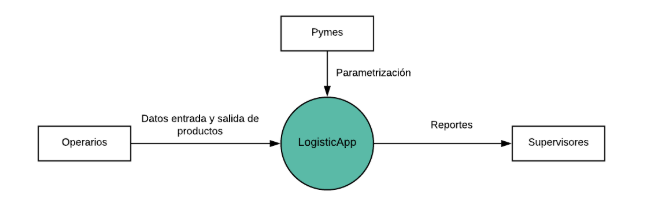

# Conoce LogisticApp
**Visita el repositorio en GitHub,** [LogisticApp](https://github.com/steelheart93/LogisticApp)

## Carpetas Compartidas del Grupo
* [Reuniones](https://drive.google.com/drive/u/0/folders/1yId2IfPIDdAhFavqeNVNsL0p5qPsZzdR)
* [Recursos de Proyecto de Logística](https://drive.google.com/drive/u/0/folders/1mpDpeHUwC9ujBUCYYHVHMnLMkfdks-Ou)

## Cursos de Interés
* [Curso C# Ya](http://www.tutorialesprogramacionya.com/csharpya/)
* [Curso ASP.Net Ya](http://www.tutorialesprogramacionya.com/aspnetya/)
* [Curso ASP.Net MVC Ya](http://www.tutorialesprogramacionya.com/aspnetmvcya/)
* [Curso Angular Ya](http://www.tutorialesprogramacionya.com/angularya/)
* [Curso Node.js Ya](http://www.tutorialesprogramacionya.com/javascriptya/nodejsya/)

## Enlaces de Descarga de Software
* [The Software Process Dashboard](https://www.processdash.com/)
* [WhiteStarUML Home Page](http://whitestaruml.sourceforge.net/)

## Información de Interés acerca del Proyecto

* * *
### Contacto
| **Rol** | **Nombre** | **E-mail** |
| Líder del Equipo | Juan Jose Lopez Giraldo | [jlopezg8@gmail.com](mailto:jlopezg8@gmail.com) |
| Administrador de Planeación | Felipe Andres Quintero Higuita | [felipeandresqh@gmail.com](mailto:felipeandresqh@gmail.com) |
| Administrador de Soporte | Stiven Muñoz Murillo | [stivenmm1993@gmail.com](mailto:stivenmm1993@gmail.com) |
| Administrador de Calidad | Elisabeth Campuzano Jaramillo | [pordefinir@gmail.com](mailto:pordefinir@gmail.com) |
| Administrador Desarrollo | Juan Pablo Sánchez | [juan47s@hotmail.com](mailto:juan47s@hotmail.com) |

###### Header 6

| head1        | head two          | three |
|:-------------|:------------------|:------|
| ok           | good swedish fish | nice  |
| out of stock | good and plenty   | nice  |
| ok           | good `oreos`      | hmm   |
| ok           | good `zoute` drop | yumm  |

* * *
#### Otros Enlaces de Interés
* [GitHub Pages themes](https://github.com/pages-themes)
* **Architect theme:** [Code](https://github.com/pages-themes/architect/edit/master/index.md) & [Page](https://pages-themes.github.io/architect/)
