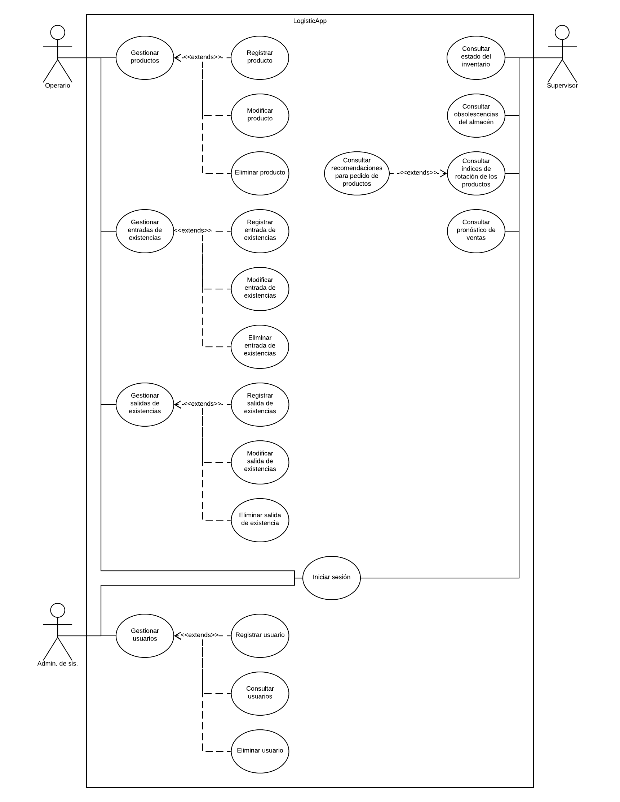

# Conoce LogisticApp

**Visita el repositorio en GitHub,** [LogisticApp](https://github.com/steelheart93/LogisticApp)

## Carpetas Compartidas del Grupo

* [Proyecto de Logística - Carpeta Principal](https://drive.google.com/drive/u/0/folders/1yId2IfPIDdAhFavqeNVNsL0p5qPsZzdR)
* [Proyecto de Logística - Planes individuales](https://drive.google.com/drive/u/0/folders/11MXSxojzKIcIO-_0bzkY-wmZLcPlCMS8)
* [Proyecto de Logística - Recursos](https://drive.google.com/drive/u/0/folders/1mpDpeHUwC9ujBUCYYHVHMnLMkfdks-Ou)
* [Proyecto de Logística - Reuniones](https://drive.google.com/drive/folders/1Z_R3x5r9OZ94QyFcYEsKsa9C_DfdcSzl)
* [Lucidchart - Carpeta Principal](https://www.lucidchart.com/documents#docs?folder_id=192269092&browser=icon&sort=saved-desc)
* [Lucidchart - Proyecto](https://www.lucidchart.com/documents#docs?folder_id=192672845&browser=icon&sort=saved-desc)

## Cursos de Interés

* [Curso C# Ya](http://www.tutorialesprogramacionya.com/csharpya/)
* [Curso ASP.Net Ya](http://www.tutorialesprogramacionya.com/aspnetya/)
* [Curso ASP.Net MVC Ya](http://www.tutorialesprogramacionya.com/aspnetmvcya/)
* [Curso Angular Ya](http://www.tutorialesprogramacionya.com/angularya/)
* [Curso Node.js Ya](http://www.tutorialesprogramacionya.com/javascriptya/nodejsya/)
* [Creación de una API web con ASP.NET Core](https://docs.microsoft.com/es-es/aspnet/core/tutorials/first-web-api?view=aspnetcore-2.2&tabs=visual-studio)

## Enlaces de Descarga de Software

* [The Software Process Dashboard](https://www.processdash.com/)
* [WhiteStarUML Home Page](http://whitestaruml.sourceforge.net/)
* [Slack Downloads Windows](https://slack.com/intl/es-co/downloads/windows)

## Arquitecturas de Referencia

* [Profesora Sandra](https://github.com/steelheart93/Barcos-v8a)
* [Profesor Oscar](https://github.com/steelheart93/WhiteStartUML)

* * *

## Información de Interés acerca del Proyecto

#### Diagrama de Contexto (07/06/2019)

#### Diagrama de Casos de Uso (04/07/2019)

#### Transferencia de Estado Representacional - REST Descripción (Wikipedia 08/08/2019)
Si bien el término REST se refería originalmente a un conjunto de principios de arquitectura —descritos más abajo—, en la actualidad se usa en el sentido más amplio para describir cualquier interfaz entre sistemas que utilice directamente HTTP para obtener datos o indicar la ejecución de operaciones sobre los datos, en cualquier formato (XML, JSON, etc) sin las abstracciones adicionales de los protocolos basados en patrones de intercambio de mensajes, como por ejemplo SOAP. Es posible diseñar sistemas de servicios web de acuerdo con el estilo arquitectural REST de Fielding y también es posible diseñar interfaces XMLHTTP de acuerdo con el estilo de llamada a procedimiento remoto (RPC), pero sin usar SOAP. Estos dos usos diferentes del término REST causan cierta confusión en las discusiones técnicas, aunque RPC no es un ejemplo de REST.

REST afirma que la web ha disfrutado de escalabilidad como resultado de una serie de diseños fundamentales clave:

* Un protocolo cliente/servidor **sin estado**: cada mensaje HTTP contiene toda la información necesaria para comprender la petición. Como resultado, ni el cliente ni el servidor necesitan recordar ningún estado de las comunicaciones entre mensajes. Sin embargo, en la práctica, muchas aplicaciones basadas en HTTP utilizan cookies y otros mecanismos para mantener el estado de la sesión (algunas de estas prácticas, como la reescritura de URLs, no son permitidas por REST)

* Un conjunto de **operaciones bien definidas** que se aplican a todos los recursos de información: HTTP en sí define un conjunto pequeño de operaciones, las más importantes son **POST, GET, PUT y DELETE**. Con frecuencia estas operaciones se equiparan a las operaciones CRUD en bases de datos (CLAB en castellano: **crear,leer,actualizar,borrar**) que se requieren para la persistencia de datos, aunque POST no encaja exactamente en este esquema.

* Una **sintaxis universal** para identificar los recursos. En un sistema REST, cada recurso es direccionable únicamente a través de su URI.

* El **uso de hipermedios**, tanto para la información de la aplicación como para las transiciones de estado de la aplicación: la representación de este estado en un sistema REST son **típicamente** HTML o XML. Como resultado de esto, es posible navegar de un recurso REST a muchos otros, simplemente siguiendo enlaces sin requerir el uso de registros u otra infraestructura adicional.

* * *

## Posibles Riesgos

1. Los miembros abandonan el proyecto antes de que finalice.
2. Existencia de más cambios de requirimientos de los previstos inicialmente.
3. Retrasos en la especificación de interfaces esenciales.
4. El tamaño y tiempo del requisito se ha subestimado.
5. Los miembros no cuentan con los conocimientos requeridos para enfrentar la complejidad del requisito.
6. Miembros del equipo enfermos y/o no disponibles en momentos críticos.
7. Cambios de requisitos que precisan modificaciones en el diseño y/o en la codificación.
8. Los clientes no comprenden el impacto de los cambios en los requerimientos. Quejas de los stakeholders.
9. El cliente no puede participar en revisiones y/o en reuniones.
10. Los stakeholders cambian debido algún motivo externo.
11. El tamaño y tiempo del desarrollo del sistema está subestimado.
12. Problemas financieros dentro del equipo de desarrollo causan díficultades en el proceso.
13. Problemas con el hardware del equipo de desarrollo.
14. Baja moral de los miembros.
15. Malas relaciones entre los miembros del equipo.
16. Falta de iniciativa de la dirección.
17. Rechazo de los miembros del equipo al uso de nuevas herramientas y/o tecnologías.
18. Fracaso en el cumplimiento de los tiempos planificados.

## Plan de Contingencias

5. Compartir cursos de los diferentes temas con los miembros del equipo, investigar la posibilidad de obtener asesoria externa.
6. Reorganizar el equipo de tal forma que se solapen el trabajo, para ello los miembros deben comprender el trabajo de los demás.
7. Rastrear la información para valorar el posible impacto de cambios no planeados, maximizar los esfuerzos para que el impacto de dichos cambios en la estimación de tiempo de desarrollo sea mínimo y continuar pronto con el ritmo normal de trabajo. 
11. Alertar al cliente acerca de las dificultades potenciales y posibilidades de retraso.
12. Preparar un documento breve para los stakeholders que muestra que el proyecto hace contribuciones muy importantes para lograr los objetivos del negocio, y así, solicitar financiación.

* * *

## Preguntas Frecuentes

1. ¿Cuáles son mis labores dentro del Equipo?
2. ¿Qué es Slack?

## Respuestas

1. La respuesta a la pregunta está disponible en el siguiente documento, [Roles de Bolsillo.](roles.pdf)
2. La respuesta a la pregunta está disponible en el siguiente documento, [Slack.](Slack.pdf) 
Para una respuesta más exhaustiva puede remitirse al siguiente documento, [Slack Exhaustivo.](SlackExhaustivo.pdf)

* * *

## Glosario (Lista de Definición)

<dl>

<dt>Especificación de una interfaz</dt>
<dd>
Una expresión formal de las características de una interfaz necesarias para asegurar la totalcompatibilidad (esto es, física y funcional) entre dos sistemas asociados. Para la total compatibilidad, la especificación de la interfaz debería incluir la especificación física de la interfaz y la especificación funcional de la interfaz.
</dd>

<dt>Exhaustivo</dt>
<dd>
Se dice de lo que agota un tema o materia, es decir, que trata todos los casos posibles o, al menos, una enorme cantidad de ellos.
Ejemplo: Una colección o enumeración exhaustiva, es aquella en la que todos los casos o elementos posibles han sido tomados en cuenta.</dd>

</dl>

* * *

### Contacto con los Miembros

| **Rol** | **Nombre** | **E-mail** | **GitHub** |
| Líder del Equipo | Juan Jose Lopez Giraldo | [jlopezg8@gmail.com](mailto:jlopezg8@gmail.com) | jlopezg8 |
| Administrador de Soporte | Stiven Muñoz Murillo | [stivenmm1993@gmail.com](mailto:stivenmm1993@gmail.com) | steelheart93 |
| Administrador de Planeación | Felipe Andres Quintero | [felipeandresqh@gmail.com](mailto:felipeandresqh@gmail.com) | Felipeandresqh |
| Admin. de Calidad | Elisa | [elisabeth.1701618252@ucaldas.edu.co](mailto:elisabeth.1701618252@ucaldas.edu.co) | ElisaCampuzano |
| Administrador Desarrollo | Juan Pablo Sánchez | [juan47s@hotmail.com](mailto:juan47s@hotmail.com) | juan47s |

* * *

#### Otros Enlaces de Interés

* [GitHub Pages themes](https://github.com/pages-themes)
* **Architect theme:** [Code](https://github.com/pages-themes/architect/edit/master/index.md) & [Page](https://pages-themes.github.io/architect/)

